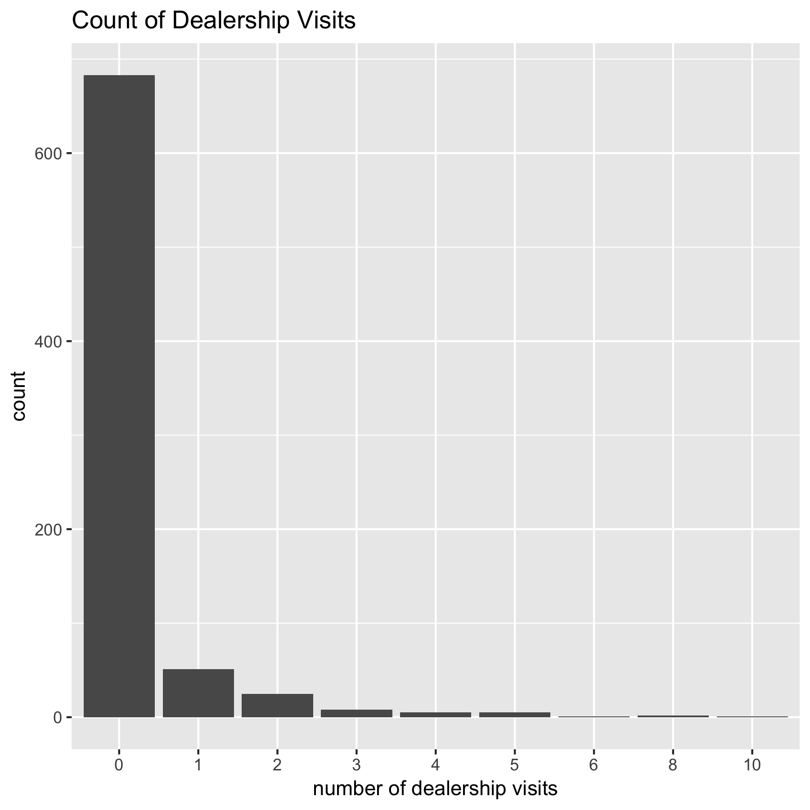
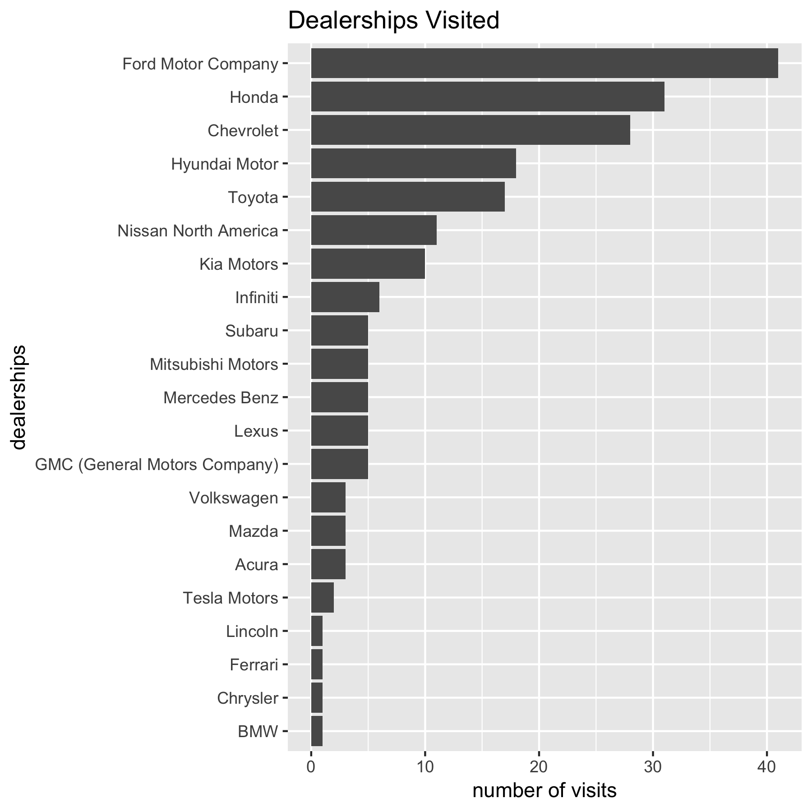

## Data Dictionary

- Initial Survey
- Geolocation Data
- Ownership Data
- Recontact Survey

## Visualize Initial Survey

- Who are the people who responded to the initial survey (breakdown by age, gender, income, location)?

Add plots.

## Visualize Geolocation Data

{width=300px}

---

{width=300px}

## Visualize Ownership Data

- How many respondents own how many cars?

{width=300px}

- What is the count of years of cars owned?
- Who are the people we have ownership data for (breakdown by age, gender, income, location)?

Add plots.

- Likelihood of purchasing a used vehicle factored by level of education. 1 being the least educated

{width=300px}

-Likelihood of purchasing a new vehicle factored by level of education. 1 being the least educated

{width=300px}

- Anticipated price of future vehicle by gender

{width=300px}

- Anticipated price of future vehicle by age

{width=300px}

- Top 10 preferences in future car

{width=300px}

Racial distribution of survey participants

{width = 300px}
Number of children

{width = 300px}

## Visualize Recontact Survey

- How many respondents responded to the recontact survey?
- Who are the people who responded to the recontact survey (breakdown by age, gender, income, location)?

Add plots.

## Model Validation

...

